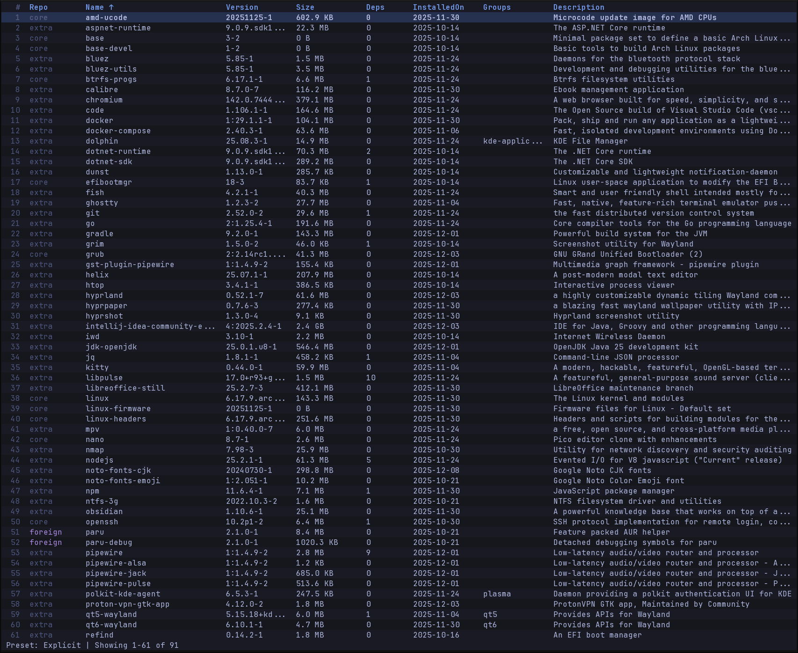

# pacviz

A terminal user interface for managing Arch Linux packages.



## Features

- Browse installed packages in a sortable, filterable table
- Presets for quickly viewing Explicit, Dependency, Orphan, Foreign, AUR, and Updatable packages
- Search the official sync databases and install packages
- Remove installed packages with sudo authentication
- Update detection — see at a glance which packages have newer versions available
- Vim-style navigation and command mode
- Themeable with 6 built-in themes

## Installation

### Keybindings

| Key | Action |
|-----|--------|
| `j` / `k` or `Up` / `Down` | Navigate rows |
| `h` / `l` or `Left` / `Right` | Navigate columns |
| `Space` | Sort by current column |
| `/` | Filter packages |
| `Tab` | Cycle presets |
| `Enter` | Toggle detail panel |
| `Esc` | Close panel / clear filter / exit remote mode |
| `g` / `G` | Jump to top / bottom |
| `Ctrl+U` / `Ctrl+D` | Page up / down |
| `i` | Install selected package (remote mode, detail panel open) |
| `:` | Enter command mode |
| `q` | Quit |

### Commands

| Command | Description |
|---------|-------------|
| `:search <query>` / `:s <query>` | Search sync databases |
| `:install` / `:i` | Install selected package |
| `:remove` / `:r` | Remove selected package |
| `:preset <name>` / `:p <name>` | Switch preset |
| `:goto <line>` / `:g <line>` | Jump to line number |
| `:top` / `:t` | Scroll to top |
| `:end` / `:e` | Scroll to end |
| `:theme <name>` / `:th <name>` | Switch theme |
| `:quit` / `:q` | Quit |

### Presets

| Preset | Description |
|--------|-------------|
| Explicit | Packages you explicitly installed |
| Dependencies | Auto-installed dependency packages |
| Orphans | Dependencies no longer required by any package |
| Foreign | Packages not found in any sync database (e.g. AUR) |
| AUR | AUR and other foreign packages |
| Updatable | Packages with a newer version available |
| All | All installed packages |

## Themes

Switch themes at runtime with `:theme <name>`, or set a default in your config file.

Custom themes can be placed in `~/.config/pacviz/themes/` or `/usr/share/pacviz/themes/` as TOML files.

## Configuration

pacviz looks for configuration in the following locations:

1. `~/.config/pacviz/config.toml`
2. `/etc/pacviz/config.toml`

```toml
# Select a theme
selected_theme = "gruvbox"

# Override specific colors on top of any theme
[theme.overrides]
accent1 = "#89b4fa"
background = "#1e1e2e"
foreground = "#cdd6f4"
```

See `internal/config/config.toml` for all available options.

### Building from source

```bash
git clone https://github.com/sjsanc/pacviz.git
cd pacviz
go build -o pacviz ./cmd/pacviz
```

### Dependencies

- Arch Linux (uses libalpm)
- Go 1.21+

## Usage

```bash
pacviz
pacviz -c path/to/config.toml
```

## Contributing

Contributions are welcome. Please open an issue first to discuss what you'd like to change.

## License

[MIT](LICENSE)
